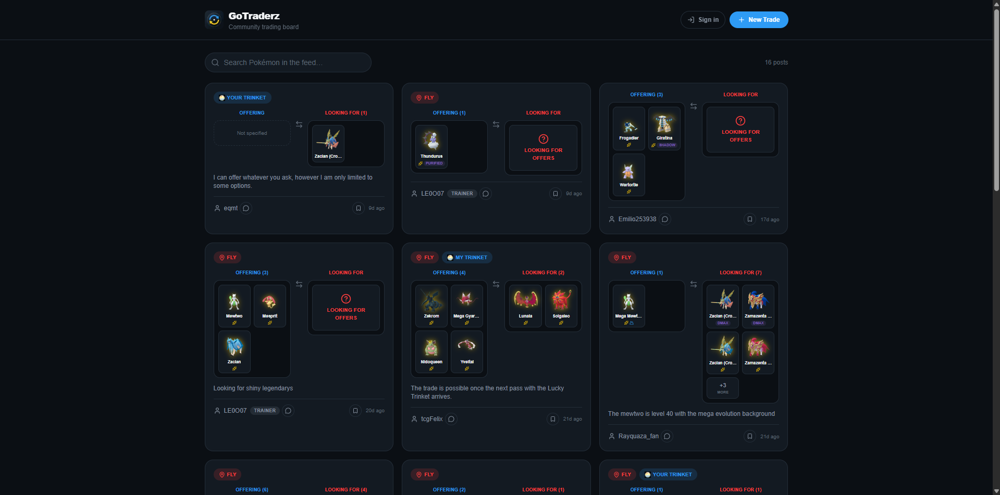

# GoTraderz

A trading platform for Pokémon GO players to post, search, and negotiate trades — with real-time chat, watchlists, and email notifications.

🔗 **Live demo:** [https://gotraderz.com](https://gotraderz.com)

<!-- TODO: replace with a screenshot or short GIF of the main trade feed. Recommended: app/page.tsx / HomeFeed in action, ~1280px wide, saved as public/screenshot.png -->

## Stack

- **Next.js 16** (App Router)
- **TypeScript**
- **Tailwind CSS**
- **Supabase** — Postgres, Auth, Storage, Row Level Security
- **Resend** — transactional email
- **Vercel** — hosting and deployment

## Features

- Trade feed with search over active listings
- Publish and edit trade posts, with a 30-minute anti-spam cooldown per user
- 1-on-1 chat with image attachments
- User blocking and reporting
- Email notifications for new messages and watchlist matches (via Supabase Database Webhooks)
- Rank/reputation system based on accumulated trade activity
- Leaderboard
- Trading guide
- Custom domain with HTTPS

## Technical highlights

- **Atomic publish/edit via `publish_trade_group()`.** Publishing or editing a trade post is a single `SECURITY DEFINER` Postgres function that deletes the user's existing rows for a `trade_group_id` and re-inserts the new set in one transaction, rather than diffing rows client-side. It verifies ownership before touching anything (rejects if another user already owns that `trade_group_id`), preserves the original `created_at` on edits, and enforces a 30-minute anti-spam cooldown read from `profiles.last_trade_action_at` — not from `user_trades`, since that table gets wiped by the delete on every edit. This avoids race conditions between concurrent publish/edit calls and keeps "new post vs. edit" as a single well-defined check instead of scattered client-side logic.
- **Decoupled, near-real-time email notifications.** New messages and watchlist matches never call Resend directly from a trigger or transaction. They insert a row into a `notification_queue` table (RLS-locked, no client access), and a Supabase Database Webhook (backed by `pg_net`) fires on insert, hitting a serverless route that queries all pending rows and sends the emails via Resend's HTTP API. The queue is idempotent by design — each invocation re-reads everything with `sent_at is null` instead of trusting the webhook payload — so retries or manual re-triggers never double-send or depend on a specific payload shape.
- **Business rules enforced at the database layer via RESTRICTIVE + PERMISSIVE RLS.** Beyond ownership checks, Postgres itself enforces cross-cutting rules that would otherwise live only in application code: a `RESTRICTIVE` policy on `messages` blocks inserts between two users if either has blocked the other, ANDed against whatever permissive insert policy already exists — no need to touch or even know that policy's definition. The same pattern (a restrictive policy layered on top of a permissive one) was used earlier for the trade-publish cooldown before it moved into the RPC.
- **Accumulated counters that survive deletion, for reliable reputation.** `total_trades_published` and `total_trades_completed` live on `profiles` and only ever increment — publishing a new trade or marking one complete bumps the counter once, guarded against double-counting (e.g. `mark_trade_completed()` no-ops if the trade is already marked complete). Because the counters aren't derived from live joins against `user_trades`, a user's rank and completed-trade history stay intact even after they delete their posts.

## Development approach

GoTraderz was built with AI-assisted development (Claude Code) under my direction as the architect and product owner — I drove the requirements, database schema design, and debugging of real production issues (auth edge cases, webhook delivery failures, RLS policy interactions), while iterating with the AI on implementation. I see this as a strength, not something to downplay: it let me move fast on infrastructure while staying deeply involved in every architectural decision.

## Disclaimer

GoTraderz is not affiliated with, endorsed by, or associated with Niantic, Inc., The Pokémon Company, Nintendo, or Game Freak. Pokémon and Pokémon GO are registered trademarks of their respective owners. This is an independent, unofficial fan project.
    